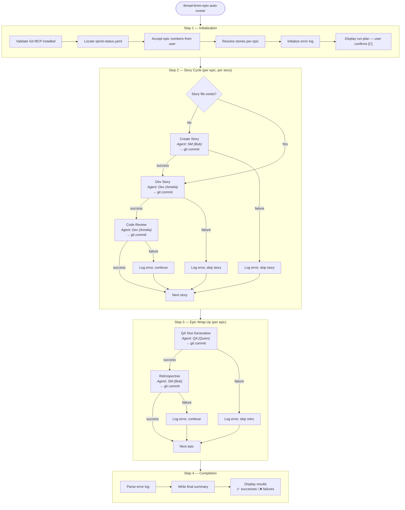

# Epic Auto Runner — Process Flow

> Autonomous build cycle workflow that runs dev, code-review, QA, and retrospective for specified epics without manual intervention.

**Slash command:** `/bmad-bmm-epic-auto-runner`  
**Workflow location:** [`_bmad/bmm/workflows/4-implementation/epic-auto-runner/`](../../../../_bmad/bmm/workflows/4-implementation/epic-auto-runner/workflow.md)  
**Creation plan:** [workflow-plan-autonomous-build-cycle.md](./workflow-plan-autonomous-build-cycle.md)  
**Validation report:** [validation-report-epic-auto-runner-2026-03-01.md](./validation-report-epic-auto-runner-2026-03-01.md)

---

## Process flow

---

## Step details

### Step 1 — Initialization

**File:** `steps-c/step-01-init.md`  
**User interaction:** This is the only step where the user provides input.

1. Validates Git MCP is installed (hard requirement — halts if missing)
2. Locates `sprint-status.yaml` in `_bmad-output/implementation-artifacts/`
3. Prompts user for epic numbers (e.g. `2 3`)
4. Parses sprint-status.yaml and resolves the full story list per epic
5. Initializes a dated error log at `_bmad-output/epic-auto-runner-errors-{date}.md`
6. Displays run plan and waits for `[C]` to confirm

### Step 2 — Story Cycle

**File:** `steps-c/step-02-story-cycle.md`  
**Fully autonomous — no user input.**

For each epic, for each story (sequentially):

| Sub-step | Agent | What it does | On failure |
|---|---|---|---|
| Check story file | — | If file already exists, skip to dev | — |
| Create Story | SM (Bob) | Generates the story file with full context | Log error, skip entire story |
| Dev Story | Dev (Amelia) | Implements the story (TDD, strict task execution) | Log error, skip code review |
| Code Review | Dev (Amelia) | Reviews and auto-fixes the implementation | Log error, continue to next story |

Every successful sub-step triggers a `git commit` via Git MCP.  
Every failure is logged with full context and the workflow continues.

### Step 3 — Epic Wrap-Up

**File:** `steps-c/step-03-epic-wrap.md`  
**Fully autonomous — no user input.**

For each epic (after all its stories are processed):

| Sub-step | Agent | What it does | On failure |
|---|---|---|---|
| QA Automate | QA (Quinn) | Generates E2E/API tests for the epic | Log error, skip retrospective |
| Retrospective | SM (Bob) | Reviews outcomes, extracts lessons learned | Log error, continue to next epic |

### Step 4 — Completion

**File:** `steps-c/step-04-complete.md`

1. Parses the error log to build a full picture of the run
2. Appends a structured summary section to the error log file
3. Displays a final report: successes per story, failures, totals
4. Points user to the error log path for details

---

## Key design decisions

| Decision | Rationale |
|---|---|
| **Never blocks** | If any step fails, the error is logged and the workflow moves to the next story/epic. You wake up to results, not a stuck process. |
| **Fresh context per sub-agent** | Each agent (SM, Dev, QA) gets only the context it needs, not the full conversation history. Prevents context pollution. |
| **Git commit after every step** | Granular rollback possible. Each commit message is descriptive (e.g. `dev-story epic-2 story-4`). |
| **Error log as the record** | Every success and failure is tracked in a dated markdown file. Step 4 summarizes it into a table. |
| **Sequential execution** | Stories processed one at a time, epics one at a time. No parallelism — keeps Git history clean and errors traceable. |
| **Self-review pattern** | Code review uses the Dev agent (same as dev-story). Intentional — fresh context means it's effectively a different reviewer. |

---

## Prerequisites

- **Git MCP** must be installed — the workflow validates this upfront and halts with install instructions if missing
- **`sprint-status.yaml`** must exist — run `/bmad-bmm-sprint-planning` first
- **Story artefacts** (PRD, architecture, epics list) should be solid — the workflow trusts them and doesn't validate content quality

---

## Outputs

| Output | Location |
|---|---|
| Committed code per story step | Git history |
| Story files (if created) | `_bmad-output/implementation-artifacts/` |
| QA test files | `_bmad-output/test-artifacts/` |
| Retrospective reports | `_bmad-output/implementation-artifacts/` |
| Error log | `_bmad-output/epic-auto-runner-errors-{date}.md` |
